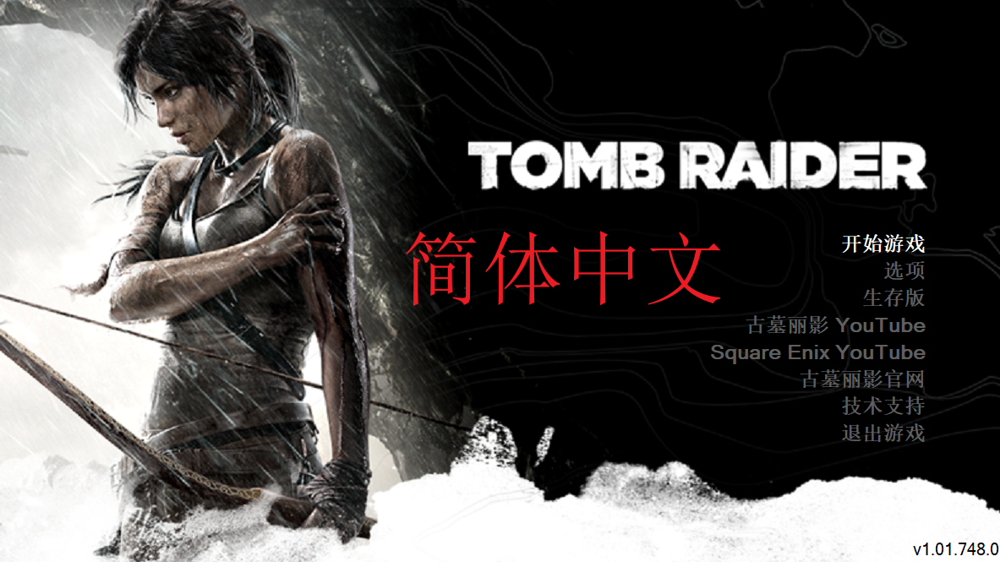

<div align="center">

# Tomb Raider 2013 Simplified Chinese

### 《古墓丽影（2013）》简体中文翻译 Mod

**面向 Windows Steam 版《古墓丽影（2013）》，提供完整简体中文界面、字幕、过场文本与中文字体。**



</div>

## Download / 下载

请前往本仓库的 [Releases](../../releases) 页面下载正式安装包：

```text
TR2013-Simplified-Chinese.zip
```

> [!IMPORTANT]
> 请下载 Release 页面中单独提供的 `TR2013-Simplified-Chinese.zip`。GitHub 自动生成的
> `Source code (zip)` 和 `Source code (tar.gz)` 只是仓库快照，不能作为 Mod 安装包使用。

## Overview / 简介

本 Mod 为 Windows Steam 版《Tomb Raider (2013) / 古墓丽影（2013）》制作完整简体中文
本地化，覆盖菜单、HUD、设置、任务与教程、技能和武器说明、剧情对白、环境对话、战斗喊话、
无线电、文献与收集品、实时过场动画字幕、外部影片字幕及多人模式相关文本。

翻译以英文原文为主要语义依据，官方繁体中文作为重要参考，并结合剧情场景、人物身份与语气、
实际玩法和《古墓丽影：崛起》《古墓丽影：暗影》的官方简体术语重新判断。这不是机械繁简转换；
项目会在准确传达原意的前提下统一名称、称呼和玩法用语，使文本更符合简体中文玩家的阅读习惯。

本 Mod 替换游戏原有的中文文本。安装后，游戏仍显示“Chinese / 中文”语言选项；
选择该选项后会加载本 Mod 的简体中文内容，不会额外增加一个独立的“简体中文”菜单项。

本 Mod 是由 Tomb Raider (2013) Mod Manager 安装的静态资源 Mod，不修改
`TombRaider.exe`，也不包含 DLL、脚本、启动器、注入器或后台程序。

## Important Notes / 重要说明

1. 本 Mod 面向 **Windows Steam 版《Tomb Raider (2013)》**。
2. 安装必须使用
   [TR2013 Modding Tools / Tomb Raider (2013) Mod Manager](https://www.nexusmods.com/tombraider2013/mods/112?tab=files&show_file=442)
   **1.10.0**；该工具不包含在本项目的安装包中。
3. **请勿使用 Mod Manager 1.11.0 安装本 Mod。** 本项目历史测试中，该版本可能造成实时
   CG 卡死、文献朗读无声或返回主菜单异常。遇到这些问题时，应先通过 Steam 验证游戏文件，
   再使用 1.10.0 重新安装。
4. 安装后必须在游戏语言设置中选择 **Chinese / 中文**，否则简体中文内容不会生效。
5. 本 Mod 会占用并替换游戏原有中文槽中的本地化资源，不能在同一槽位同时保留官方繁体文本。
6. 不要同时安装其他会修改中文文本、字幕、中文字体或相同资源的 Mod。
7. 本 Mod 不包含游戏本体；使用前必须通过合法渠道拥有并安装游戏。

## Main Features / 主要内容

### 完整简体中文内容

- 菜单、HUD、设置、任务目标、教程和系统提示
- 技能、武器升级、物品、地图、营地和多人模式界面
- 主线对白、环境对话、劳拉独白、战斗喊话和无线电通讯
- 文献、日记、遗物、GPS 秘宝及其他收集品文本与朗读字幕
- 游戏引擎实时过场动画和外部影片字幕

### 语境化翻译与术语统一

- 以英文原文为主要依据，不机械照搬繁体中文
- 结合人物关系、事件顺序、现场动作和玩法机制判断短句含义
- 统一人物、地点、组织、武器、技能和交互提示等重复术语
- 参考系列后续作品的官方简体用语，同时保留本作自身的叙事风格
- 保留按键图标、颜色标记、占位符、换行和其他游戏所需格式

### 字体与阅读体验

- 使用 **Noto Sans SC Bold 700** 作为重建中文字体资源的主要字形来源
- 使用 **Noto Sans KR Bold 700** 仅补充多人模式中的韩文玩家名
- 支持菜单、字幕、长文档以及多人玩家名所需的常用文字显示
- 调整中文字幕背景的可读性，并清理不适合中文显示的斜体标记

## Package Contents / 发布包内容

Release 提供的安装 ZIP 包含 Mod Manager 可识别的本地化文本、游戏内字幕、实时过场字幕、
外部影片字幕、中文字体和相关许可文件。

安装包不包含游戏本体、Mod Manager、可执行程序、DLL、启动器或注入组件。字体版权与许可证
可在本仓库的 [THIRD_PARTY_NOTICES.md](THIRD_PARTY_NOTICES.md) 及对应字体文件中直接查阅。

## Recommended Environment / 推荐环境

- 游戏：Windows Steam 版《Tomb Raider (2013)》
- 安装工具：Tomb Raider (2013) Mod Manager 1.10.0
- 游戏语言：Chinese / 中文
- 安装前状态：未安装其他中文文本、字幕、字体或相同资源 Mod

如果此前使用过其他汉化、测试包、Mod Manager 1.11.0，或曾手动处理游戏目录中的 Mod 文件，
建议先通过 Steam 验证游戏文件完整性，再开始安装。

## Installation / 安装方法

1. 完全退出游戏。
2. 从 [Releases](../../releases) 下载 `TR2013-Simplified-Chinese.zip`，不要解压后逐个复制资源。
3. 安装并打开 Tomb Raider (2013) Mod Manager 1.10.0。
4. 在 Mod Manager 中选择《Tomb Raider (2013)》。
5. 点击 `Install mod from archive`，选择下载的 Mod ZIP。
6. 等待 Mod Manager 完成安装，然后从 Steam 启动游戏。
7. 进入游戏语言设置，将语言设为 **Chinese / 中文**。

## Updating / 更新方法

1. 关闭游戏。
2. 使用 Mod Manager 1.10.0 卸载已经安装的旧版 Mod。
3. 如果曾混装其他汉化、使用过 1.11.0 或出现过异常，先通过 Steam 验证游戏文件完整性。
4. 从 [Releases](../../releases) 下载新的同名安装 ZIP。
5. 按照上方安装步骤重新安装，并确认游戏语言仍为 Chinese / 中文。

不要在旧版仍处于安装状态时直接手动替换游戏目录中的 Mod 归档。

## Uninstallation / 卸载方法

1. 关闭游戏。
2. 打开 Tomb Raider (2013) Mod Manager 1.10.0。
3. 在已安装 Mod 列表中找到本 Mod，并使用 Mod Manager 的卸载或移除功能。
4. 重新启动游戏，确认原有中文资源已经恢复。

> [!WARNING]
> 不要在 Mod 仍处于安装状态时手动删除游戏目录中的 `.tiger` 文件。若卸载后仍有异常，
> 请使用 Steam 的“验证游戏文件完整性”恢复原版资源。

## Compatibility / 兼容性说明

- 本 Mod 只面向 Windows Steam 版；其他商店、平台或修改过的游戏版本未经过同等验证。
- 本 Mod 会覆盖中文槽中的文本、字幕和字体资源，与修改相同内容的 Mod 可能发生冲突。
- 本 Mod 不修改关卡流程、角色属性、敌人 AI、武器数值、配音、音乐或存档结构。
- 游戏或 Mod Manager 更新后，如果资源处理方式发生变化，需要重新确认兼容性。

## Troubleshooting / 故障排查

### 安装后仍显示英文或繁体中文

- 确认下载的是 Release 附件中的 `TR2013-Simplified-Chinese.zip`，不是 Source code 压缩包。
- 确认使用的 Mod Manager 版本为 1.10.0，且安装过程已经完成。
- 确认游戏语言已经设置为 Chinese / 中文。
- 暂时移除其他中文文本、字幕或字体 Mod，排除资源覆盖冲突。

### CG 卡死、文献无声或返回主菜单异常

- 确认没有使用 Mod Manager 1.11.0 安装本 Mod。
- 先通过 Mod Manager 正常卸载相关 Mod，不要直接删除仍在使用的 `.tiger` 文件。
- 在 Steam 中验证游戏文件完整性。
- 使用 Mod Manager 1.10.0，在干净状态下重新安装当前 Release 的正式 ZIP。

### 安装或卸载失败

- 完全退出游戏后再操作 Mod Manager。
- 确认游戏目录可正常访问，并检查 Mod Manager 显示的完整错误信息。
- 如果曾手动删除文件或混装多个资源 Mod，先使用 Steam 验证恢复原版，再重新安装。

## Credits / 制作信息与许可

**制作人：** NoWindNoMoon / 此情无关风月

**简体中文字形：** Noto Sans SC Bold 700

**韩文玩家名补字：** Noto Sans KR Bold 700

本仓库采用 [权利与使用声明](LICENSE.md)。字体及其衍生内容继续遵循
SIL Open Font License 1.1；完整来源、版权和许可边界见：

- [第三方许可说明](THIRD_PARTY_NOTICES.md)
- [Noto Sans SC 版权声明](NotoSansSC-COPYRIGHT.md)
- [Noto Sans SC OFL 1.1](NotoSansSC-OFL.md)
- [Noto Sans KR 版权声明](NotoSansKR-COPYRIGHT.md)
- [Noto Sans KR OFL 1.1](NotoSansKR-OFL.md)

游戏名称、商标和原始游戏资产归各自权利人所有。本 Mod 是非官方、非商业的玩家制作项目，
与游戏开发商、发行商、平台方及字体权利人没有隶属、认可或赞助关系。

## Support / 赞赏支持

如果这个项目对您有所帮助，欢迎自愿赞赏支持。赞赏不会作为下载、使用或获取更新的前提。

<table>
  <tr>
    <td align="center" width="50%">
      <br>
      <strong>支付宝赞赏</strong>
    </td>
    <td align="center" width="50%">
      <br>
      <strong>微信赞赏</strong>
    </td>
  </tr>
</table>

## Feedback / 反馈

如果发现翻译、显示或安装问题，请在本仓库的 [Issues](../../issues) 提交反馈，并尽量提供：

- 具体任务、章节、场景、角色或界面位置
- 问题发生前后的完整文本和未缩放截图
- 游戏平台、Mod Manager 版本及安装步骤
- 是否同时安装了其他文本、字幕、字体或资源 Mod
- 可以稳定复现问题的操作步骤和完整错误信息

欢迎反馈英文或繁体残留、错译、字幕缺失或异常换行、文本溢出、字体缺字或错位、安装、更新、
卸载及游戏运行异常。

感谢每一位使用、测试和反馈问题的玩家。
